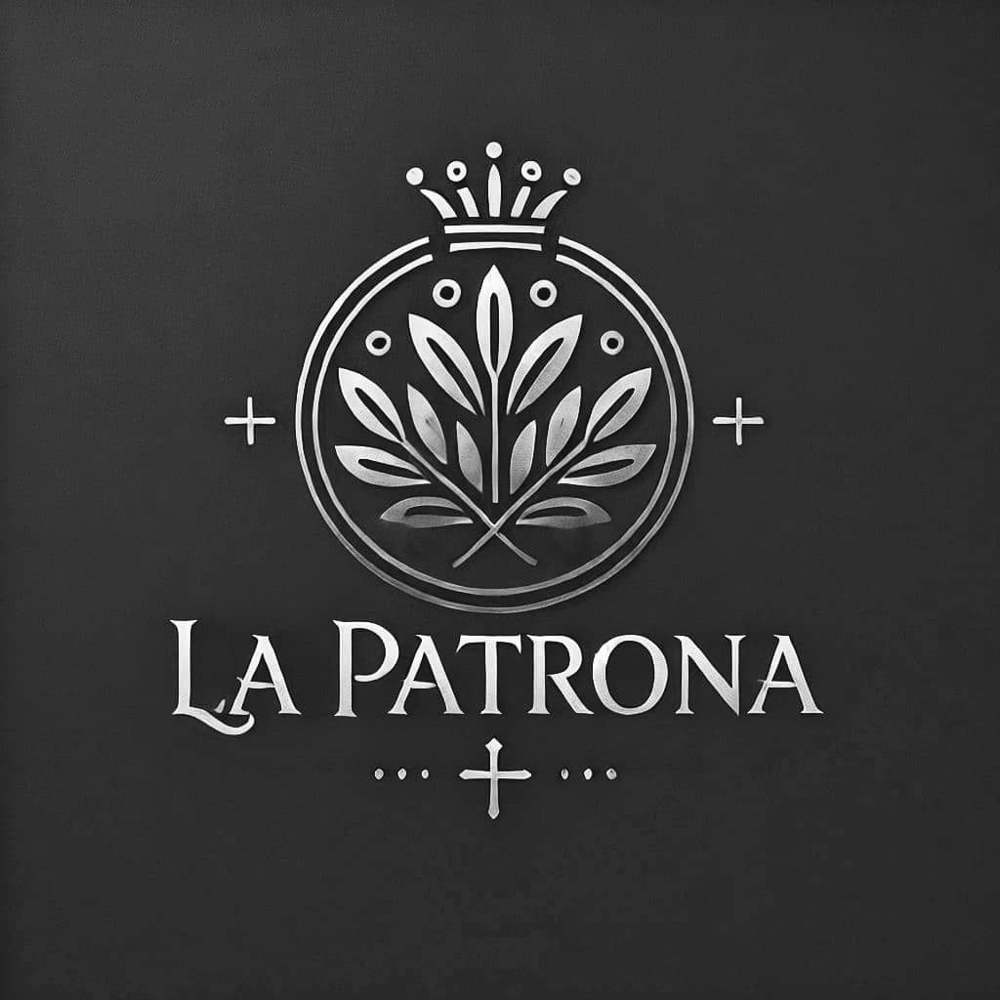

# La Patrona - Sistema de Gestión de Contabilidad 💼

<!-- Agrega un banner si lo tienes -->

Sistema moderno de gestión contable para Startups desarrollado con tecnologías de vanguardia.

## ¿Qué es La Patrona?
[...]

## 🚀 Características Principales

- **Gestión contable integral**: Ingresos, gastos, facturación y balances
- **Dashboard interactivo**: Métricas financieras en tiempo real
- **Generación de facturas**: Balance general, estado de resultados, flujo de efectivo
- **Personalización**: Plantillas adaptables a diferentes modelos de negocio

## 🛠 Stack Tecnológico

- **Frontend**: 
  - Next.js 15 (App Router)
  - Tailwind CSS
  - Shadcn/ui (Componentes UI accesibles)

- **Backend**:
  - Next.js API Routes
  - MongoDB Atlas (Base de datos NoSQL)
  - Mongoose (ODM)

- **Herramientas**:
  - TypeScript
  - Axios (Client HTTP)

## ⚙️ Requisitos del Sistema

- Node.js 18+
- MongoDB Atlas (Cuenta gratuita)
- NPM 9+


## 🤝 Contribución
Haz fork del proyecto

Crea tu feature branch:

``` bash
git checkout -b feature/nueva-funcionalidad
```
Realiza tus cambios y envía un Pull Request

## 📄 Licencia
Este proyecto está bajo licencia MIT - ver LICENSE.md para más detalles.

# 📬 Contacto
Equipo de Desarrollo de La Patrona
- brothersreboot@gmail.com
- andyechc@gmail.com